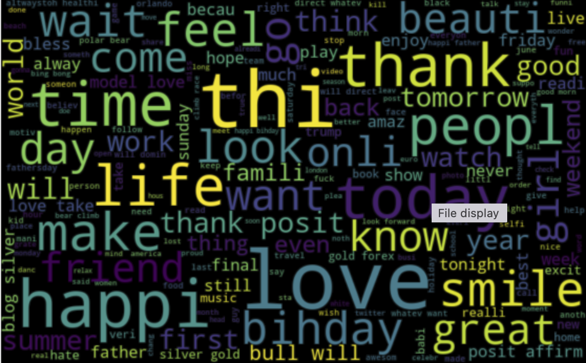
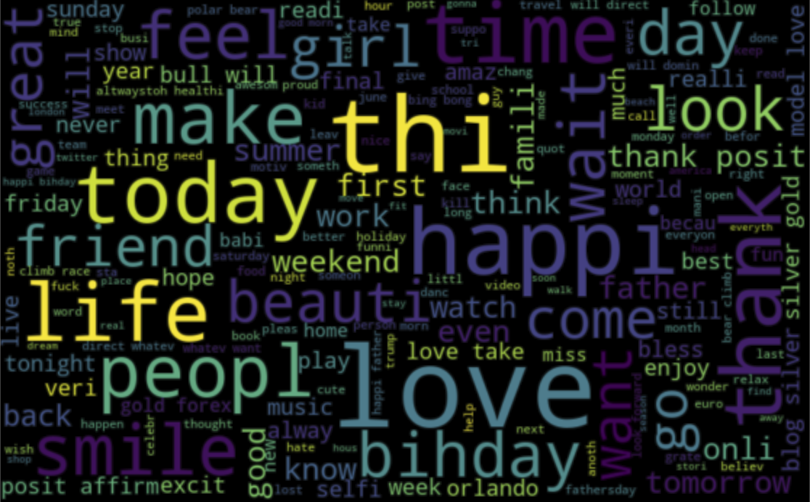
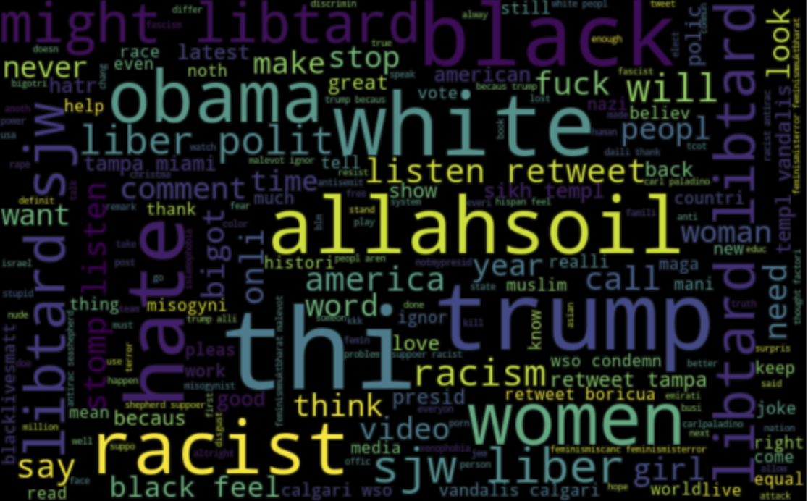
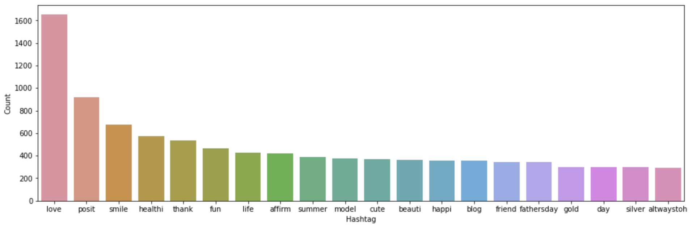
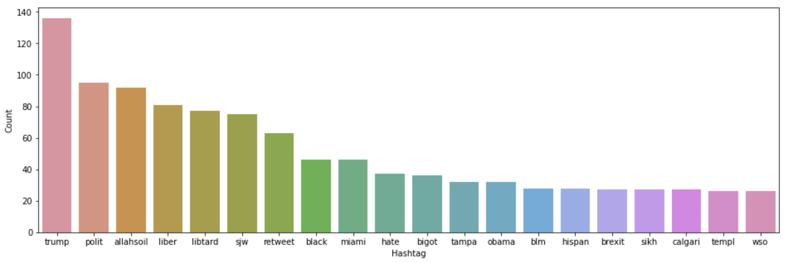

# Twitter Hate Speech Detection using NLP and Machine Learning

A Natural Language Processing (NLP) project for detecting hate speech in Twitter posts using traditional machine learning algorithms. This project implements a complete NLP pipeline including text preprocessing, exploratory data analysis, feature extraction, and comparative evaluation of multiple supervised learning models for binary tweet classification.

---

## Overview

Hate speech on social media platforms has become a significant challenge due to its impact on individuals and online communities. Automatic detection of offensive and discriminatory content enables faster content moderation and helps create safer online environments.

This project demonstrates a complete NLP workflow for Twitter hate speech detection, including text cleaning, feature engineering, exploratory data analysis through word clouds and hashtag analysis, and evaluation of multiple machine learning classifiers.

---

## Dataset

**Dataset:** Twitter Hate Speech Dataset

**Task:** Binary Classification (Racist / Non-Racist Tweets)

The dataset contains tweets labeled as either racist or non-racist. Before model training, the tweets were preprocessed using several NLP techniques, including:

- Lowercase conversion
- Removal of URLs, mentions, hashtags, punctuation, and special characters
- Tokenization
- Stopword removal
- Stemming
- Feature extraction using Bag of Words and TF-IDF

---

## Exploratory Data Analysis

### Word Cloud Visualization

Word clouds provide an overview of the most frequently occurring words after text preprocessing.

### All Tweets

The overall corpus contains commonly occurring conversational words across the entire dataset.



### Non-Racist Tweets

The non-racist tweets are dominated by positive and everyday conversational vocabulary related to friendship, family, happiness, and daily life.



### Racist Tweets

The racist tweet corpus contains offensive and discriminatory vocabulary, highlighting the linguistic characteristics associated with hate speech.



---

## Hashtag Analysis

Frequently occurring hashtags provide additional insight into the topics discussed within each class of tweets.

### Top Hashtags in Non-Racist Tweets

The non-racist tweets are characterized by positive and lifestyle-oriented hashtags such as **#love**, **#smile**, **#healthy**, and **#thank**.



### Top Hashtags in Racist Tweets

The racist tweet subset contains hashtags associated with political discussions and hate speech, demonstrating a noticeably different vocabulary from the non-racist class.



---

## Feature Engineering

The textual data was transformed into numerical feature representations using two widely used NLP techniques:

- Bag of Words (Count Vectorizer)
- TF-IDF (Term Frequency–Inverse Document Frequency)

These feature representations were then used to train and evaluate multiple machine learning classifiers.

---

## Models Evaluated

The project compares the performance of the following supervised machine learning algorithms:

- Logistic Regression
- Support Vector Machine (SVM)
- Random Forest
- XGBoost

---

## Tech Stack

- Python
- Jupyter Notebook
- NumPy
- Pandas
- NLTK
- Scikit-learn
- XGBoost
- Gensim
- WordCloud
- Matplotlib
- Seaborn

---

## How to Run

1. Clone the repository.

```bash
git clone https://github.com/yourusername/twitter-hate-speech-detection.git
```

2. Install the required dependencies.

```bash
pip install -r requirements.txt
```

3. Download the required NLTK resources.

```python
import nltk

nltk.download('punkt')
nltk.download('stopwords')
```

4. Open `TWITTER SENTIMENT ANALYSIS.ipynb` using Jupyter Notebook or JupyterLab.

5. Run all cells sequentially.

---

## Results

Four supervised machine learning algorithms were implemented and evaluated for hate speech detection:

- Logistic Regression
- Support Vector Machine (SVM)
- Random Forest
- XGBoost

Among the evaluated models, **Random Forest** achieved the best overall performance on the dataset, demonstrating its effectiveness in distinguishing between racist and non-racist tweets using TF-IDF-based text features.

The project illustrates how traditional machine learning techniques, combined with appropriate NLP preprocessing and feature engineering, can effectively classify hate speech in social media text.

---

## Future Improvements

- Fine-tune transformer-based language models such as BERT for hate speech detection.
- Explore deep learning architectures including LSTMs and Transformers.
- Extend the model for multiclass offensive language classification.
- Deploy the trained model as a web application for real-time tweet classification.
- Evaluate contextual word embedding techniques for improved performance.

---

## Acknowledgements

This project was developed using the following open-source libraries and frameworks:

- Scikit-learn
- XGBoost
- NLTK
- Pandas
- NumPy
- Matplotlib
- Seaborn
- WordCloud
- Gensim

---

## License

This project is licensed under the MIT License.
